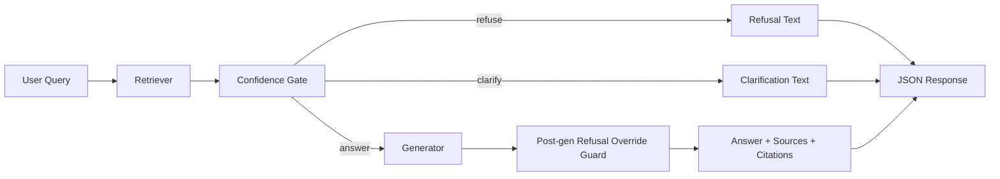
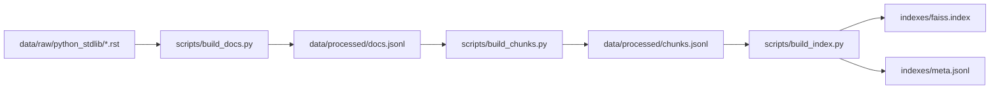

# Enterprise Knowledge Assistant

Enterprise Knowledge Assistant is a retrieval-augmented generation (RAG) service focused on Python standard library documentation.

It combines:
- FAISS dense retrieval over chunked stdlib docs
- A rule-based confidence gate that returns `answer`, `clarify`, or `refuse`
- GPT-backed generation with citation extraction
- FastAPI endpoints for query serving, health, and log-derived stats
- Evaluation and experiment tooling for threshold and behavior tuning

## Current Scope

In scope:
- Corpus: Python stdlib docs under `data/raw/python_stdlib`
- Retrieval: sentence-transformers embeddings + FAISS index
- Safety/control: confidence gating + mismatch detection + post-generation refusal override guard
- Offline evaluation and phase-gated experiment workflows

Known behavior to keep in mind:
- `GET /stats` summarizes `logs/queries.jsonl` if present.
- `POST /query` currently does not append to `logs/queries.jsonl`.
- Legacy eval (`scripts/run_eval.py`) expects `eval/questions.jsonl`.

## Repository Layout

```text
enterprise-knowledge-assistant/
  config.yaml
  requirements.txt
  Dockerfile
  docker-compose.yml
  src/
    api/
    rag/
    retrieval/
    embeddings/
    chunking/
    ingest/
    eval_runner/
    utils/
  scripts/
    build_docs.py
    build_chunks.py
    build_index.py
    validate_docs.py
    validate_chunks.py
    validate_index.py
    validate_eval.py
    run_eval.py
    debug/
    experiments/
  data/
    raw/python_stdlib/
    processed/
  indexes/
  eval/
  eval_v2/
  artifacts/
  tests/
```

## Runtime Architecture



Build pipeline:



## Requirements

- Python 3.11+
- API key when generation is enabled:
  - `OPENAI_API_KEY`
- Optional (for Docker usage): Docker + Docker Compose

## Quick Start (Local)

### 1) Create environment and install dependencies

```powershell
python -m venv .venv
.\.venv\Scripts\Activate.ps1
pip install -r requirements.txt
```

### 2) Set environment variables

```powershell
$env:OPENAI_API_KEY="sk-..."
```

You can also place the key in `.env` for local development.

### 3) Validate or build artifacts

Validate first:

```powershell
python scripts/validate_docs.py
python scripts/validate_chunks.py
python scripts/validate_index.py
```

If artifacts are missing or invalid, rebuild in order:

```powershell
python scripts/build_docs.py
python scripts/build_chunks.py
python scripts/build_index.py
```

### 4) Run API

```powershell
python -m uvicorn src.api.main:app --reload --host 0.0.0.0 --port 8000
```

### 5) Smoke test

```powershell
curl http://localhost:8000/health
curl -X POST http://localhost:8000/query -H "Content-Type: application/json" -d '{"query":"How do I open a sqlite3 connection?"}'
```

## API Endpoints

### `POST /query`

Request body:

```json
{
  "query": "How do I open a sqlite3 connection?"
}
```

Notes:
- Query cannot be empty or whitespace.
- Optional header: `X-Request-ID` (UUID auto-generated if omitted).
- Response includes `type`, `answer`, `confidence`, `sources`, `citations`, and `meta`.

### `GET /health`

Returns startup/runtime dependency status:
- `status`: `ok` or `degraded`
- `pipeline_loaded`
- dependency flags for retriever, gate, generator
- startup errors (if any)

### `GET /stats`

Computes aggregate metrics from `logs/queries.jsonl`:
- total queries
- per-type counts
- confidence/top-score/latency averages
- source and groundedness aggregates

Important: this endpoint reports only what is already in the log file.

## Configuration

Defaults in `config.yaml`:

```yaml
chunking:
  chunk_size: 800
  overlap: 150

embeddings:
  model_name: "sentence-transformers/all-MiniLM-L6-v2"
  normalize: true
  batch_size: 64

index:
  index_path: "indexes/faiss.index"
  meta_path: "indexes/meta.jsonl"

retrieval:
  top_k: 5

confidence:
  threshold_high: 0.40
  threshold_low: 0.25
  margin_min: 0.03

logging:
  enabled: true
  path: "logs/queries.jsonl"

generation:
  enabled: true
  model: "gpt-4o-mini"
  temperature: 0.0
```

Notes:
- `threshold_low < threshold_high` is required.
- `margin_min` is used as a tie/ambiguity signal, not a global score cutoff.
- If `generation.enabled` is `true`, startup requires `OPENAI_API_KEY`.

## Script Catalog

### Build and Validation

- `python scripts/build_docs.py`: Build `data/processed/docs.jsonl` from raw stdlib docs.
- `python scripts/build_chunks.py`: Split docs into chunk records.
- `python scripts/build_index.py`: Embed chunks and build FAISS + metadata artifacts.
- `python scripts/validate_docs.py`: Schema and stats checks for processed docs.
- `python scripts/validate_chunks.py`: Chunk schema/offset/uniqueness checks.
- `python scripts/validate_index.py`: Cross-check chunks vs meta vs FAISS vectors.
- `python scripts/validate_eval.py`: Validate legacy eval question schema.

### Runtime and Debug

- `python scripts/debug/query_retrieve.py "<query>"`: Inspect retrieved chunks and citation-formatted context.
- `python scripts/debug/query_gate.py "<query>"`: Inspect confidence gate decision and rationale.
- `python scripts/debug/query_pipeline.py "<query>"`: Run end-to-end pipeline and print full output.

### Evaluation

- `python scripts/run_eval.py`: Legacy eval flow (expects `eval/questions.jsonl`).
- `python scripts/experiments/run_eval_v2_synthetic.py ...`: Flexible eval over eval_v2/manual datasets.
- `python scripts/experiments/run_diagnostic_citation_signal.py`: Citation signal diagnostic suite.
- `python scripts/experiments/calibrate_thresholds.py`: Recommend threshold updates from result files.

Example (refined synthetic dataset):

```powershell
python scripts/experiments/run_eval_v2_synthetic.py --dataset eval_v2/synthetic_scaffold_dataset_refined.jsonl --results eval_v2/synthetic_refined_results.jsonl --summary eval_v2/synthetic_refined_summary.json --category-field refined_category --expected-type-field expected_type_refined
```

### Experiment Orchestration

- `python scripts/experiments/run_phase0_baseline.py`: Generate baseline bundle + reproducibility check.
- `python scripts/experiments/run_phase_gate.py`: Baseline reuse/rebaseline + candidate + comparison gate.
- `python scripts/experiments/run_phase1_threshold_sweep.py`: Sweep threshold pairs through phase-gated workflow.
- `python scripts/experiments/compare_ablation_runs.py`: Compare baseline and candidate bundles.
- `python scripts/experiments/run_failure_diagnostics.py --predictions-jsonl ...`: Failure taxonomy diagnostics.
- `python scripts/experiments/summarize_phase1b_results.py ...`: Before/after summary reports.
- `python scripts/experiments/cleanup_phase_runs.py [--execute]`: Archive old experiment runs (dry-run by default).
- `python scripts/experiments/prepare_synthetic_eval_v2.py`: Build synthetic eval scaffold.
- `python scripts/experiments/refine_benchmark_labels_phase1.py`: Create refined label variants.

Batch launcher:
- `scripts/experiments/run_experiment.bat` wraps `run_phase_gate.py` for Windows.

## Testing

Run full suite:

```powershell
pytest tests/ -v
```

Common targeted runs:

```powershell
pytest tests/test_retriever.py -v
pytest tests/test_confidence.py -v
pytest tests/test_index_artifacts.py -v
pytest tests/test_pipeline_refusal_override_guard.py -v
```

LLM smoke test (skips when `OPENAI_API_KEY` is absent):

```powershell
pytest tests/test_generator_smoke.py -v
```

## Docker

Build and run:

```powershell
docker build -t enterprise-knowledge-assistant:latest .
docker run --rm -p 8000:8000 -e OPENAI_API_KEY=sk-... enterprise-knowledge-assistant:latest
```

Compose:

```powershell
docker compose up --build
```

Compose maps local `./logs` to container `/app/logs`.

## Troubleshooting

| Symptom | Likely cause | What to check |
|---|---|---|
| API starts as `degraded` | Missing index/meta artifacts or missing API key | `GET /health` startup errors, then run validate/build scripts |
| `POST /query` returns 400 | Empty/whitespace query | Send non-empty text |
| `POST /query` returns 502 | Upstream generation error | API key, model access, network/provider status |
| Frequent `refuse` results | Out-of-scope query or mismatch guard trigger | Use module/function-specific prompts and debug scripts |
| `/stats` mostly zeros | Log file absent/empty | Populate `logs/queries.jsonl` or wire request logging |
| `validate_index` fails | Artifact misalignment | Rebuild: docs -> chunks -> index |

## Contributor Notes

- Keep README endpoint examples aligned with `src/api/schemas.py` and `src/api/main.py`.
- Keep command examples aligned with scripts in `scripts/` and `scripts/experiments/`.
- If query logging is wired into `POST /query` later, update `/stats` caveats in this document.
