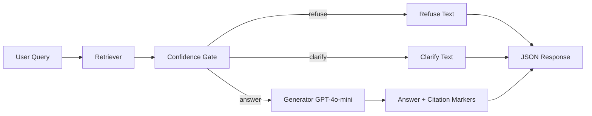
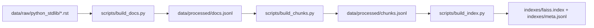

# Enterprise Knowledge Assistant

Enterprise Knowledge Assistant is a retrieval-augmented generation (RAG) service for Python standard library documentation.

It combines:
- FAISS-based dense retrieval over processed Python stdlib docs
- A deterministic confidence gate that decides `answer`, `clarify`, or `refuse`
- GPT-4o-mini generation for grounded answers with citations
- FastAPI endpoints for query, health, and aggregate stats

## Current State

Implemented today:
- Rule-based mismatch detection in the confidence gate (module hints, symbol checks, topic consistency)
- Lexical groundedness overlap metric in legacy evaluation
- Threshold calibration and synthetic evaluation scripts

Not fully wired yet:
- Request-time query logging from `POST /query` into `logs/queries.jsonl`
- `GET /stats` aggregates only what is present in the log file

## Architecture

### Inference Flow



### Data Build Flow



## Repository Layout

```text
enterprise-knowledge-assistant/
  config.yaml
  requirements.txt
  src/
    api/
    rag/
    retrieval/
    embeddings/
    chunking/
    ingest/
    eval_runner/
    monitoring/
    utils/
  scripts/
    build_docs.py
    build_chunks.py
    build_index.py
    validate_docs.py
    validate_chunks.py
    validate_index.py
    validate_eval.py
    run_eval.py
    debug/
    experiments/
  data/
    raw/python_stdlib/
    processed/
  indexes/
  eval/
  eval_v2/
  tests/
```

## Requirements

- Python 3.11+
- OpenAI API key when generation is enabled (`config.yaml -> generation.enabled: true`)

## Quick Start (Local)

### 1) Create environment and install deps

```bash
python -m venv .venv
# Windows PowerShell
.\.venv\Scripts\Activate.ps1
# macOS/Linux
# source .venv/bin/activate

pip install -r requirements.txt
```

### 2) Set API key

```powershell
$env:OPENAI_API_KEY="sk-..."
```

### 3) Ensure index artifacts exist

If you already have these files, you can skip rebuild:
- `indexes/faiss.index`
- `indexes/meta.jsonl`

Validation commands:

```bash
python scripts/validate_docs.py
python scripts/validate_chunks.py
python scripts/validate_index.py
```

If validation fails or artifacts are missing, rebuild in order:

```bash
python scripts/build_docs.py
python scripts/build_chunks.py
python scripts/build_index.py
```

### 4) Run API

```bash
python -m uvicorn src.api.main:app --reload --host 0.0.0.0 --port 8000
```

### 5) Smoke check

```bash
curl http://localhost:8000/health
curl -X POST http://localhost:8000/query -H "Content-Type: application/json" -d '{"query":"How do I read JSON files in Python?"}'
```

## Docker

```bash
docker build -t enterprise-knowledge-assistant:latest .
docker run --rm -p 8000:8000 -e OPENAI_API_KEY=sk-... enterprise-knowledge-assistant:latest
```

Compose:

```bash
docker compose up --build
```

## API Reference

### POST `/query`

Request body:

```json
{
  "query": "How do I open a sqlite3 connection?"
}
```

Optional request header:
- `X-Request-ID`: caller-provided request id (UUID is auto-generated if omitted)

Response shape (from `src/api/schemas.py`):

```json
{
  "type": "answer",
  "answer": "Use sqlite3.connect(path) to open a connection [1].",
  "confidence": 0.56,
  "sources": [
    {
      "chunk_id": "sqlite3_001_004",
      "doc_id": "sqlite3",
      "module": "sqlite3",
      "score": 0.56,
      "source_path": "data/raw/python_stdlib/sqlite3.rst"
    }
  ],
  "citations": [
    {
      "id": 1,
      "chunk_id": "sqlite3_001_004",
      "doc_id": "sqlite3",
      "module": "sqlite3",
      "source_path": "data/raw/python_stdlib/sqlite3.rst",
      "heading": "sqlite3.connect",
      "start_char": 120,
      "end_char": 480,
      "score": 0.56
    }
  ],
  "meta": {
    "top_score": 0.56,
    "retrieved_k": 5,
    "latency_ms_total": 940.2,
    "latency_ms_retrieval": 42.3,
    "latency_ms_generation": 881.1,
    "request_id": "6d44d6b1-9f10-45f7-b7fb-c37613d8c1ef"
  }
}
```

Result types:
- `answer`: strong evidence, generation returned a usable answer
- `clarify`: medium confidence or recoverable mismatch
- `refuse`: weak evidence, hard mismatch, or post-generation refusal override

### GET `/health`

Current response shape:

```json
{
  "status": "ok",
  "service": "enterprise-knowledge-assistant",
  "timestamp": "2026-03-28T11:00:00+00:00",
  "pipeline_loaded": true,
  "dependencies": {
    "retriever_loaded": true,
    "gate_loaded": true,
    "generator_loaded": true
  },
  "startup_errors": []
}
```

If startup checks fail, `status` becomes `degraded`, `pipeline_loaded` is `false`, and `startup_errors` contains details.

### GET `/stats`

`/stats` computes aggregates from `logs/queries.jsonl` if present.

Returned fields:
- `total_queries`
- `type_counts` (`answer`, `clarify`, `refuse`)
- `avg_confidence`
- `avg_top_score`
- `avg_latency_ms_total`
- `avg_latency_ms_retrieval`
- `avg_latency_ms_generation`
- `avg_num_sources`
- `avg_groundedness_overlap`
- `answer_only_avg_groundedness_overlap`

Important: API query handling does not currently append records to this log automatically.

## Configuration

`config.yaml` defaults:

```yaml
chunking:
  chunk_size: 800
  overlap: 150

embeddings:
  model_name: "sentence-transformers/all-MiniLM-L6-v2"
  normalize: true
  batch_size: 64

index:
  index_path: "indexes/faiss.index"
  meta_path: "indexes/meta.jsonl"

retrieval:
  top_k: 5

confidence:
  threshold_high: 0.40
  threshold_low: 0.25
  margin_min: 0.03

logging:
  enabled: true
  path: "logs/queries.jsonl"

generation:
  enabled: true
  model: "gpt-4o-mini"
  temperature: 0.0
```

Notes:
- `margin_min` applies when top hits compete across different topics, not as a global score cutoff.
- If `generation.enabled` is `true`, startup requires `OPENAI_API_KEY`.

## Testing

Run all tests:

```bash
pytest tests/ -v
```

Run selected suites:

```bash
pytest tests/test_retriever.py -v
pytest tests/test_confidence.py -v
pytest tests/test_index_artifacts.py -v
```

LLM smoke test (skips automatically when `OPENAI_API_KEY` is not set):

```bash
pytest tests/test_generator_smoke.py -v
```

Test prerequisites:
- Raw docs under `data/raw/python_stdlib/`
- Processed docs/chunks and index/meta artifacts in expected locations

## Evaluation

### Legacy fixed-path evaluation

```bash
python scripts/run_eval.py
```

This path expects `eval/questions.jsonl`. That file is not currently present in this repository snapshot.

### Active dataset evaluations

Manual dataset in repo:

```bash
python scripts/experiments/run_eval_v2_synthetic.py --dataset eval/manual.jsonl --results eval/manual_results.jsonl --summary eval/manual_summary.json --category-field category --expected-type-field expected_type
```

Synthetic refined dataset in repo:

```bash
python scripts/experiments/run_eval_v2_synthetic.py --dataset eval_v2/synthetic_scaffold_dataset_refined.jsonl --results eval_v2/synthetic_refined_results.jsonl --summary eval_v2/synthetic_refined_summary.json --category-field refined_category --expected-type-field expected_type_refined
```

## Debug Scripts

Useful local diagnostics:

```bash
python scripts/debug/query_retrieve.py "How do I parse command line arguments?"
python scripts/debug/query_gate.py "How do I parse command line arguments?"
python scripts/debug/query_pipeline.py "How do I parse command line arguments?"
```

## Troubleshooting

| Symptom | Likely cause | Fix |
|---|---|---|
| API starts as degraded | Missing index/meta or missing API key | Build index artifacts and set `OPENAI_API_KEY` |
| `POST /query` returns 502 | Upstream generation provider failed | Check API key, model access, network, provider status |
| `POST /query` returns 400 | Empty/whitespace query | Send non-empty query text |
| `POST /query` often returns `refuse` | Query out-of-corpus or mismatch detection triggered | Ask module-specific query; inspect retrieval/gate debug scripts |
| `/stats` is mostly zeros | Log file missing or empty | Generate/populate log records; current API path does not auto-log |
| Index validation fails | Artifact misalignment | Rebuild in order: docs -> chunks -> index |

## Notes for Contributors

- Prefer validating artifacts before running full tests.
- Keep README examples aligned with `src/api/schemas.py` and `src/api/main.py` when API fields change.
- If query logging is wired into API in future, update `/stats` caveat in this README.
