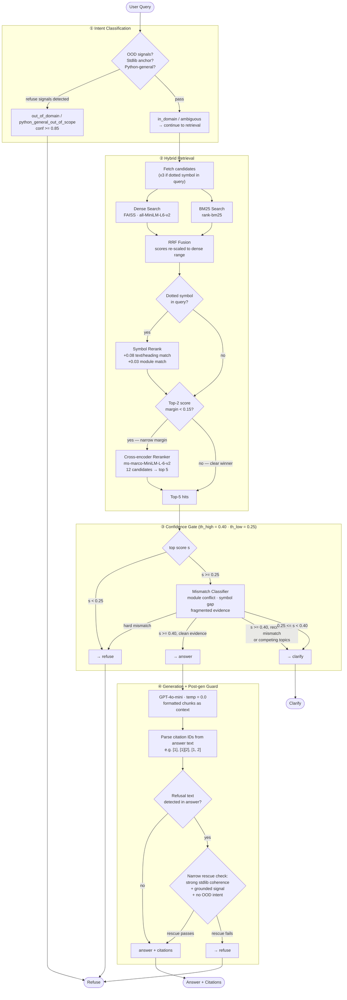

# Enterprise Knowledge Assistant
[github.com/VinaySampath14/enterprise-knowledge-assistant](https://github.com/VinaySampath14/enterprise-knowledge-assistant)

A production-style API that answers questions about the Python standard library — engineered to **never confidently return a wrong answer**. The system refuses or asks for clarification rather than guessing, a guarantee that held across all 13 iterative versions built and evaluated during development.

Built with hybrid retrieval (dense + BM25 + cross-encoder reranking), a multi-stage confidence gate, and a structured ablation methodology: every version evaluated on three independent test sets, regressions reverted immediately, all runs tracked in MLflow.

---

## Key Results

The system prioritizes correctness over coverage. A **false answer** (expected refuse, predicted answer) is treated as a safety failure — it was held to 0.00% across every promoted version. The 0.8% gap between manual and holdout accuracy confirms generalisation to unseen query phrasing.

| Metric | Value |
|--------|-------|
| Manual benchmark accuracy | 75.8% (33 questions) |
| Paraphrased holdout accuracy | 75.0% (20 questions) |
| Real-world query accuracy | 69.9% (93 user-phrased queries, held out from all tuning) |
| False answer rate | **0.00%** across all 13 ablation versions |
| False refusal rate | 0.00% in champion version |
| RAGAS faithfulness | 0.914 |
| RAGAS answer relevancy | 0.911 |
| Avg latency | 1608ms (p50: 1165ms, p95: 4608ms) |

---

## What I Built

- **Retrieval pipeline** — hybrid dense (FAISS/all-MiniLM-L6-v2) + BM25 with RRF fusion; conditional cross-encoder reranking (ms-marco-MiniLM-L-6-v2) triggered only when top-2 score margin is narrow
- **Confidence gate** — multi-stage decision logic (intent classification → score thresholds → mismatch detection → post-generation override) that routes every query to `answer`, `clarify`, or `refuse`
- **Evaluation framework** — 3 independent test sets (manual, synthetic, holdout), 13 ablation versions tracked in MLflow, RAGAS for faithfulness and answer relevancy
- **Production API** — FastAPI with `/health`, `/stats`, structured per-request logging, Docker + Compose support, per-stage latency breakdown in every response

---

## What It Does

- **Corpus**: Python stdlib RST documentation, chunked and indexed
- **Decision logic**: Intent classification → confidence gate → GPT-4o-mini generation → post-generation refusal override
- **Response types**: `answer`, `clarify`, or `refuse` — never a hallucinated answer
- **Observability**: Every query logged to `logs/queries.jsonl`; `GET /stats` aggregates in real time

## Architecture



## Prerequisites

- Python 3.11
- `OPENAI_API_KEY` — required for generation
- ~500 MB disk for model caches (SentenceTransformer + cross-encoder download on first run)

## Quick Start

### 1. Setup

```bash
python -m venv .venv
source .venv/bin/activate        # Windows: .\.venv\Scripts\Activate.ps1
pip install -r requirements.txt
```

### 2. Configure API key

```bash
export OPENAI_API_KEY="sk-..."   # Windows: $env:OPENAI_API_KEY="sk-..."
```

Or create a `.env` file:

```env
OPENAI_API_KEY=sk-...
```

### 3. Validate or build artifacts

```bash
python scripts/validate_docs.py
python scripts/validate_chunks.py
python scripts/validate_index.py
```

If validation fails or artifacts are missing, build them:

```bash
python scripts/build_docs.py     # Stage 1: RST → data/processed/docs.jsonl
python scripts/build_chunks.py   # Stage 2: docs → data/processed/chunks.jsonl
python scripts/build_index.py    # Stage 3: chunks → indexes/faiss.index + meta.jsonl
```

### 4. Run the API

```bash
python -m uvicorn src.api.main:app --reload --host 0.0.0.0 --port 8000
```

## API

### `POST /query`

```json
{ "query": "How do I open a sqlite3 connection?" }
```

Optional header: `X-Request-ID`

**Response fields**

| Field | Type | Description |
|-------|------|-------------|
| `type` | `"answer"` \| `"clarify"` \| `"refuse"` | Decision outcome |
| `answer` | string | Response text (empty string when type is `refuse`) |
| `confidence` | float | Top retrieval score used by the gate |
| `sources` | array | Chunk metadata (module, score, path) |
| `citations` | array | Full citation objects with char offsets and headings |
| `meta` | object | Gate rationale, intent label, latency breakdown, reranker flags |

**Response types**

- `answer` — retrieval confidence is high; context was used to generate a grounded response
- `clarify` — query is ambiguous or confidence is borderline; asks for more specificity
- `refuse` — query is out-of-domain, confidence is too low, or generation returned a refusal

**Error codes**

| Code | Cause |
|------|-------|
| 400 | Empty or whitespace query |
| 500 | Internal pipeline error |
| 502 | OpenAI generation failure |
| 503 | Pipeline not initialized (check `/health`) |

### `GET /health`

Returns `{ status, pipeline_loaded, dependencies, startup_errors }`. Status is `"ok"` or `"degraded"`.

### `GET /stats`

Returns aggregate counts and averages computed live from `logs/queries.jsonl`: total queries, type distribution, avg confidence, avg latency, avg groundedness.

## Configuration

Key fields in `config.yaml`:

| Field | Default | Description |
|-------|---------|-------------|
| `retrieval.mode` | `dense` | `dense`, `bm25`, or `hybrid` |
| `retrieval.top_k` | `5` | Chunks returned to the gate and generator |
| `reranker.enabled` | `true` | Enable cross-encoder reranking |
| `reranker.strategy` | `low_margin_only` | Only rerank when top-2 score margin is narrow |
| `reranker.low_margin_threshold` | `0.15` | Margin threshold that triggers reranking |
| `confidence.threshold_high` | `0.4` | Scores above this → `answer` |
| `confidence.threshold_low` | `0.25` | Scores below this → `refuse` |
| `generation.model` | `gpt-4o-mini` | OpenAI model for response generation |
| `generation.temperature` | `0.0` | Deterministic generation |
| `logging.enabled` | `true` | Log all queries to `logs/queries.jsonl` |

## Docker

> **Note:** The Dockerfile copies `indexes/` at build time (`COPY indexes /app/indexes`). You must build the artifacts locally before running `docker build`, otherwise the container will start in a `degraded` state. Run the validate/build steps in Quick Start first.

```bash
docker build -t enterprise-knowledge-assistant:latest .
docker run --rm -p 8000:8000 -e OPENAI_API_KEY=sk-... enterprise-knowledge-assistant:latest
```

Or with compose (mounts `./logs` into the container):

```bash
docker compose up --build
```

## Reproduce Results

Build artifacts (required once before first run):
```bash
python scripts/build_docs.py      # RST → docs.jsonl
python scripts/build_chunks.py    # docs → chunks.jsonl
python scripts/build_index.py     # chunks → FAISS index
```

Run evaluation against all three sets:
```bash
python scripts/run_eval.py
python scripts/experiments/run_ragas_eval.py
```

View full experiment history in MLflow:
```bash
mlflow ui --backend-store-uri artifacts/mlflow
```

Debug a specific query through each pipeline stage:
```bash
python scripts/debug/query_pipeline.py "how does heapq work?"
python scripts/debug/query_gate.py "how does heapq work?"
```

## Experiments & Results

The system was developed through 12 iterative experiments. Each version was evaluated on three held-out sets:

- **Manual** (33 queries) — human-curated across five categories
- **Synthetic** (22 queries) — LLM-generated covering in-domain, near-domain, and out-of-domain
- **Holdout** (20 queries) — paraphrase set held out from all tuning

**False Answer**: expected refuse, predicted answer (safety-critical).
**False Refusal**: expected answer, predicted refuse (quality-impacting).

### Decision Quality Ablation

| Version | What Changed | Manual | Synth | Holdout | False Ans | False Ref | Safety | Decision |
|---------|-------------|--------|-------|---------|-----------|-----------|--------|----------|
| baseline | Confidence-gate cleanup | 60.6% | 90.9% | 65.0% | 6.1% | 6.1% | fail | REF |
| v1 | Intent layer — upstream conservative routing | 69.7% | 90.9% | 70.0% | 0.0% | 6.1% | warn | GO |
| v2 | Post-gen refusal soften to clarify (broad) | 54.6% | 77.3% | 60.0% | 0.0% | 0.0% | pass | **NO-GO** — large accuracy regression |
| v3 | Narrow grounded rescue fallback | 69.7% | 90.9% | 70.0% | 0.0% | 6.1% | warn | GO |
| v4 | Symbol-anchor rescue refinement | 69.7% | 90.9% | 70.0% | 0.0% | 6.1% | warn | HOLD — no change vs v3 |
| v5 | Retrieval rerank for explicit dotted symbols | 72.7% | 90.9% | 70.0% | 0.0% | 3.0% | pass | GO — false-refusal halved |
| v6 | Citation-retry post-generation | 72.7% | 90.9% | 70.0% | 0.0% | 3.0% | pass | HOLD — no improvement |
| v7 | Hybrid retrieval (initial RRF scoring) | 54.6% | 63.6% | 60.0% | 0.0% | 30.3% | fail | **NO-GO** — RRF scores mismatched confidence thresholds, near-universal refusals |
| v8 | Hybrid retrieval (RRF rank + dense-scale score) | 72.7% | 90.9% | 70.0% | 0.0% | 3.0% | pass | HOLD — parity with v5, no uplift |
| v9 | Cross-encoder reranker (ms-marco-MiniLM-L-6-v2), always-on | 75.8% | 90.9% | 75.0% | 0.0% | 0.0% | pass | GO — new champion |
| v10 | Conditional reranking (low_margin_only, threshold 0.05) | 72.7% | 90.9% | 70.0% | 0.0% | 0.0% | pass | HOLD — slight regression vs v9 |
| v11 | Conditional reranking (low_margin_only, threshold 0.15) | **75.8%** | **90.9%** | **75.0%** | 0.0% | 0.0% | pass | **GO — champion; preserved quality, improved latency** |
| v12 | Lock-in confirmation run | 75.8% | 90.9% | 75.0% | 0.0% | 0.0% | pass | Final confirmation |

### Answer & Retrieval Quality (Champion Versions)

Metrics computed via RAGAS on answer-producing predictions only.

| Version | Faithfulness | Answer Relevancy | Context Precision | Keep Rate | Latency M/S/H (ms) |
|---------|-------------|-----------------|-------------------|-----------|---------------------|
| v9 | — | — | — | — | 2006 / 1434 / 1464 |
| v10 | — | — | — | — | 2012 / 1484 / 1370 |
| v11 | **0.914** | **0.911** | 0.757 | 0.452 | 1608 / 1438 / 1273 |
| v12 | 0.914 | 0.911 | 0.757 | 0.452 | **1602 / 1331 / 1213** |
| Real-world batch | — | — | — | — | 1925 avg / — / — |

Real-world batch: 93 user-phrased queries evaluated 
separately (not used in any tuning). Overall accuracy 69.9%, 
answer accuracy 83.3%, refuse accuracy 70.7%, clarify 
accuracy 37.5%.

Latency columns: M = Manual set, S = Synthetic set, H = Holdout set.

---

## Failure Taxonomy

Seven failure categories were identified and tracked across 
versions. Each category has a root cause and resolution status.

| Category | Description | Root Cause | Status |
|----------|-------------|------------|--------|
| A — In-domain false refusals | Explanatory queries refused despite high retrieval score | Mismatch check firing on conceptual queries | Resolved — baseline cleanup |
| B — Python-general leakage | GIL and decorator queries answered from training knowledge | No domain boundary before retrieval | Resolved — v1 intent classifier |
| C — Label quality | Two eval queries mislabelled as clarify | Human labelling error | Resolved — baseline |
| D — OOD landing in clarify | CSS and Dune queries falling in middle score band | th_low too low (0.25) | Resolved — baseline cleanup |
| E — Recoverable misclassification | Vague queries refused or wrongly answered | No intent layer — score was only signal | Resolved — v1 intent classifier |
| F — Score-driven instability | Similar scores producing inconsistent decisions | Score overloaded as proxy for confidence and intent | Resolved — v1 intent classifier |
| G — Lexical mismatch | Paraphrased queries scoring below threshold | General-purpose embedding model vocabulary gap | Partially resolved — v5 and v9 |

Two residual failures remain: corpus boundary cases where 
concepts appear tangentially in documentation (e.g. GIL 
mentioned in threading docs) but fall outside the system's 
intended scope.

---

### Confidence Threshold Calibration

Top retrieval score distribution by expected response type (67 samples):

| Expected Type | n | Mean Score | p25 | p75 |
|--------------|---|-----------|-----|-----|
| answer | 29 | 0.665 | 0.610 | 0.740 |
| clarify | 11 | 0.580 | 0.578 | 0.654 |
| refuse | 27 | 0.250 | 0.177 | 0.239 |

Current thresholds: `threshold_high=0.4`, `threshold_low=0.25`. Calibration proposed `0.62/0.41` but was not adopted — simulated accuracy gain (+11 pp) came at the cost of synthetic set regression.

## Testing

```bash
pip install pytest
pytest tests/ -v
```

11 test files covering: confidence gate, retriever, intent classifier, prompt formatting, cross-encoder reranker, ingest, index artifact integrity, and the post-generation refusal override guard.

## Troubleshooting

| Symptom | Cause | Fix |
|---------|-------|-----|
| `/health` returns `degraded` | Missing artifacts or API key | Check `startup_errors` field; rebuild index or set `OPENAI_API_KEY` |
| `POST /query` → 400 | Empty query | Send a non-empty `query` string |
| `POST /query` → 502 | OpenAI API error | Check API key, network, and OpenAI status |
| `GET /stats` not updating | Logging disabled | Set `logging.enabled: true` in `config.yaml` |
| All queries returning `refuse` | Score scale mismatch | Check `retrieval.mode`; if using `hybrid`, verify `confidence.threshold_high/low` are calibrated for RRF scores |
| Models not downloading | Network/cache issue | Check `models/cache/`; delete and retry, or set `HF_HOME` to a writable path |
