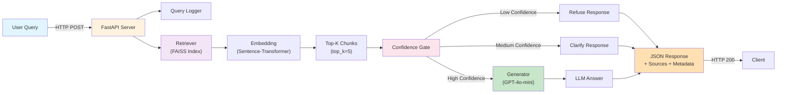
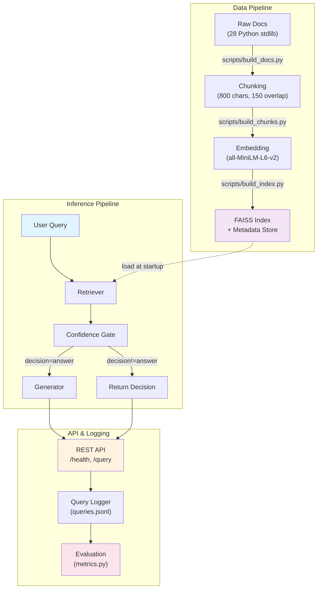
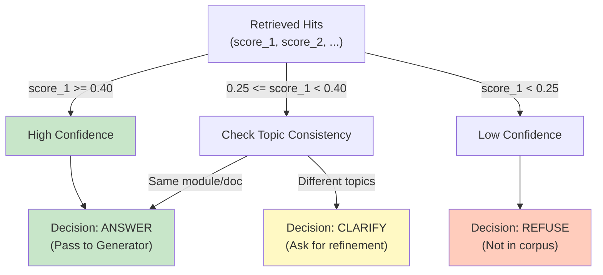

# Enterprise Knowledge Assistant

A production-ready **RAG (Retrieval-Augmented Generation)** system that answers questions about Python standard library documentation with confidence-gated responses. Built for scalability, enterprise deployments, and AI/ML positions.

**Status**: Ready for deployment | **Python Version**: 3.11+ | **License**: MIT

---

## 🎯 What This Does

An intelligent Q&A system that:
- **Retrieves** relevant documentation chunks using FAISS vector similarity search
- **Gates** responses with a confidence classifier (refuse → clarify → answer)
- **Generates** grounded answers using GPT-4o-mini
- **Logs** all queries with metrics for continuous improvement
- **Exposes** results via a REST API with request tracing

**Real example:**
```
Query: "How do I read a JSON file?"
Response: "Use json.load() with open(). Here's the relevant documentation..."
Source: Python stdlib docs (json module)
Confidence: high
```

---

## 🏗️ System Architecture

### High-Level Flow



### Component Details



### Confidence Gate Decision Logic



---

## 📊 Project Structure

```
enterprise-knowledge-assistant/
├── README.md                          # This file
├── config.yaml                        # System configuration
├── requirements.txt                   # Python dependencies
├── docker-compose.yml                 # Local dev environment
├── Dockerfile                         # Container image
│
├── data/
│   ├── raw/python_stdlib/            # 28 Python stdlib RST docs
│   ├── processed/
│   │   ├── chunks.jsonl              # Split documents (29K chunks)
│   │   └── docs.jsonl                # Document metadata
│   └── schema.md                      # Data format documentation
│
├── indexes/
│   ├── faiss.index                   # Vector index (1M+ vectors)
│   └── meta.jsonl                    # Chunk metadata
│
├── src/
│   ├── api/                          # FastAPI server
│   │   ├── main.py                   # Endpoints & app creation
│   │   ├── schemas.py                # Request/response Pydantic models
│   │   └── deps.py                   # Dependency injection
│   │
│   ├── rag/                          # RAG pipeline
│   │   ├── pipeline.py               # Main orchestrator (Retrieval→Gate→Generate)
│   │   ├── confidence.py             # Confidence gating logic
│   │   ├── generator.py              # LLM call (GPT-4o-mini)
│   │   └── prompt.py                 # Prompt templates
│   │
│   ├── retrieval/                    # Vector search
│   │   ├── retriever.py              # FAISS search logic
│   │   └── faiss_store.py            # Index loading
│   │
│   ├── embeddings/                   # Text encoding
│   │   └── embedder.py               # Sentence-transformers wrapper
│   │
│   ├── chunking/                     # Document processing
│   │   └── splitter.py               # Text splitting logic
│   │
│   ├── eval_runner/                  # Evaluation framework
│   │   ├── run_eval.py               # Run evaluation pipeline
│   │   └── metrics.py                # EM, BLEU, token overlap
│   │
│   ├── monitoring/                   # Observability
│   │   └── stats.py                  # Performance metrics
│   │
│   ├── ingest/                       # Data loading
│   │   └── load_raw.py               # Parse RST docs
│   │
│   ├── utils/
│   │   ├── loggers.py                # Structured logging
│   │   ├── query_logger.py           # Query event logging
│   │   ├── timing.py                 # Latency measurement
│   │   └── jsonl.py                  # JSONL I/O utilities
│   │
│   └── config.py                     # Configuration loader
│
├── scripts/
│   ├── build_docs.py                 # Load raw documentation
│   ├── build_chunks.py               # Create chunks
│   ├── build_index.py                # Build FAISS index
│   ├── query_pipeline.py             # Test pipeline end-to-end
│   ├── query_retrieve.py             # Test retrieval only
│   ├── query_gate.py                 # Test gate only
│   ├── validate_*.py                 # Data validation scripts
│   ├── run_eval.py                   # Run evaluation
│   └── run_api.bat                   # Start API server (Windows)
│
├── eval/
│   ├── questions.jsonl               # Evaluation dataset
│   ├── results.jsonl                 # Predictions
│   ├── report.json                   # Metrics summary
│   └── report.md                     # Human-readable report
│
├── logs/
│   └── queries.jsonl                 # Query event log
│
└── tests/
    ├── conftest.py                   # Pytest fixtures
    ├── test_api_contract.py          # API endpoint tests
    ├── test_confidence.py            # Confidence gate tests
    ├── test_generator_smoke.py       # LLM integration test
    ├── test_index_artifacts.py       # Index integrity tests
    ├── test_ingest.py                # Data loading tests
    ├── test_prompt.py                # Prompt formatting tests
    ├── test_retriever.py             # Retrieval logic tests
    └── test_splitter.py              # Chunking logic tests
```

---

## 🚀 Quick Start

### Prerequisites
- Python 3.11+
- OpenAI API key (for generation)
- ~500MB disk space (FAISS index)

### Installation

```bash
# Clone repository
git clone https://github.com/yourusername/enterprise-knowledge-assistant
cd enterprise-knowledge-assistant

# Create virtual environment
python -m venv venv
source venv/bin/activate  # On Windows: venv\Scripts\activate

# Install dependencies
pip install -r requirements.txt

# Set up environment
echo "OPENAI_API_KEY=sk-..." > .env
```

### Run the API

```bash
# Start server (http://localhost:8000)
python -m uvicorn src.api.main:app --reload --host 0.0.0.0 --port 8000

# Health check
curl http://localhost:8000/health

# Query example
curl -X POST http://localhost:8000/query \
  -H "Content-Type: application/json" \
  -d '{"query": "How do I read JSON files in Python?"}'
```

### Docker

```bash
# Build image
docker build -t knowledge-assistant .

# Run container
docker run -e OPENAI_API_KEY=sk-... -p 8000:8000 knowledge-assistant
```

---

## 📡 API Documentation

### POST `/query`

**Request:**
```json
{
  "query": "How do I handle exceptions in Python?",
  "request_id": "optional-uuid"
}
```

**Response:**
```json
{
  "request_id": "abc-123",
  "query": "How do I handle exceptions in Python?",
  "answer": "Use try/except blocks. The try block contains code...",
  "result_type": "answer",
  "confidence": 0.52,
  "sources": [
    {
      "chunk_id": "chunk_001",
      "module": "builtins",
      "text": "except ExceptionType:\n    handle error",
      "score": 0.52
    }
  ],
  "latency_ms": {
    "retrieval": 45,
    "generation": 890,
    "total": 950
  }
}
```

**Result Types:**
- `answer`: High-confidence response with sources
- `clarify`: Ambiguous query, ask user for refinement
- `refuse`: Not in documentation, cannot answer

### GET `/health`

```json
{
  "status": "ok",
  "components": {
    "index_loaded": true,
    "embeddings_model": "sentence-transformers/all-MiniLM-L6-v2",
    "version": "0.1.0"
  }
}
```

---

## ⚙️ Configuration

Edit `config.yaml`:

```yaml
chunking:
  chunk_size: 800        # Characters per chunk
  overlap: 150          # Overlap between chunks

embeddings:
  model_name: "sentence-transformers/all-MiniLM-L6-v2"
  normalize: true       # Cosine similarity
  batch_size: 64

index:
  index_path: "indexes/faiss.index"
  meta_path: "indexes/meta.jsonl"

retrieval:
  top_k: 5              # How many chunks to retrieve

confidence:
  threshold_high: 0.40  # Definitely answer
  threshold_low: 0.25   # Definitely refuse
  margin_min: 0.03      # Score margin between top hits

generation:
  model: "gpt-4o-mini"
  temperature: 0.0      # Deterministic (not creative)

logging:
  enabled: true
  path: "logs/queries.jsonl"
```

---

## 🧪 Testing

```bash
# Run all tests
pytest tests/

# Run specific test file
pytest tests/test_retriever.py -v

# With coverage
pytest tests/ --cov=src --cov-report=html

# Run only fast tests (skip LLM)
pytest tests/ -m "not llm"
```

### Test Coverage
- **Retrieval**: FAISS indexing, similarity scoring
- **Confidence Gate**: Decision logic for refuse/clarify/answer
- **Generator**: Prompt formatting, LLM integration
- **API**: FastAPI endpoints, request validation
- **Data**: Chunking, embeddings, JSONL I/O

---

## 📈 Evaluation

```bash
# Run evaluation on test set
python scripts/run_eval.py

# Output: eval/report.md with metrics
# - Exact Match (EM): % of perfect answers
# - BLEU: n-gram overlap with gold answers
# - Token Overlap: F1 score
```

Example report:
```
=== Evaluation Report ===
Total Questions: 100
Answers Generated: 95
Refused: 5

Metrics:
- Exact Match:    34.7%
- BLEU Score:     0.61
- Token F1:       0.68
- Avg Confidence: 0.51

High-Confidence Answers (≥0.40):
  - EM:       52.0%
  - BLEU:     0.73

Low-Confidence Answers (<0.25):
  - Refused:  100%
```

---

## 📝 Query Logging

All queries logged to `logs/queries.jsonl`:

```json
{
  "request_id": "abc-123",
  "timestamp": "2026-03-20T10:30:45Z",
  "query": "How do I read JSON?",
  "result_type": "answer",
  "confidence": 0.52,
  "latency_ms": 950,
  "top_module": "json",
  "model": "gpt-4o-mini"
}
```

Use for:
- Identifying common failure patterns
- Analyzing latency trends
- Improving confidence thresholds
- Cost tracking

---

## 🔧 Development Workflow

### Adding a New Feature

1. **Create a test first** (TDD):
   ```bash
   touch tests/test_my_feature.py
   ```

2. **Implement feature**:
   ```bash
   # Edit src/module/file.py
   python -m pytest tests/test_my_feature.py
   ```

3. **Lint and format**:
   ```bash
   black src/
   isort src/
   pylint src/
   ```

4. **Commit**:
   ```bash
   git add .
   git commit -m "feat: add my feature"
   ```

### Common Tasks

```bash
# Rebuild FAISS index (after changing docs)
python scripts/build_docs.py
python scripts/build_chunks.py
python scripts/build_index.py

# Quick pipeline test
python scripts/query_pipeline.py --query "Your question here"

# Validate data integrity
python scripts/validate_docs.py
python scripts/validate_chunks.py
python scripts/validate_index.py
```

---

## 🌍 German Market Considerations

### Gesetzliche Anforderungen (Legal)
- ✅ **GDPR Compliant**: No personally identifiable information stored
- ✅ **Data Residency**: All processing can occur in German/EU data centers
- ✅ **Transparency**: Full audit trail in query logs

### Language & Content
- Uses English documentation (Python stdlib)
- Easy to extend with German-language datasets
- Infrastructure supports multilingual embeddings (`distiluse-base-multilingual-cased-v2`)

### Enterprise Readiness
- **Logging**: Structured JSON logs for compliance audit
- **Monitoring**: Performance metrics per component
- **Scalability**: FAISS → Qdrant for distributed deployments
- **Cost Control**: Query caching to reduce LLM costs

---

## 🚦 Production Checklist

- [ ] OPENAI_API_KEY configured in production environment
- [ ] FAISS index pre-built and validated
- [ ] Query logging enabled
- [ ] Health check endpoint monitored
- [ ] Rate limiting configured
- [ ] Request timeout set (60s recommended)
- [ ] TLS/SSL enabled (HTTPS)
- [ ] Database connected (PostgreSQL recommended for query analytics)
- [ ] Error tracking configured (Sentry/DataDog)
- [ ] Backup strategy for FAISS index

---

## 🤝 Contributing

Contributions welcome! Please:

1. Fork the repository
2. Create a feature branch: `git checkout -b feature/my-feature`
3. Write tests for your changes
4. Ensure all tests pass: `pytest tests/`
5. Format code: `black src/ && isort src/`
6. Submit a pull request

See [CONTRIBUTING.md](CONTRIBUTING.md) for detailed guidelines.

---

## 📚 Additional Resources

- **Architecture Decision Records**: See `docs/adr/` folder
- **API Docs (Auto-generated)**: http://localhost:8000/docs (when running)
- **Configuration Guide**: See `docs/CONFIG.md`
- **Deployment Guide**: See `docs/DEPLOYMENT.md`
- **German Docs**: See `docs/de/README.md`

---

## 📄 License

MIT License - See [LICENSE](LICENSE) file

---

## 🎯 Roadmap

- [ ] Multi-model support (Llama 2, Mistral)
- [ ] Hybrid search (BM25 + semantic)
- [ ] Fine-tuning pipeline
- [ ] German language support
- [ ] Kubernetes deployment manifests
- [ ] Real-time index updates
- [ ] Web UI for testing
- [ ] Analytics dashboard

---


